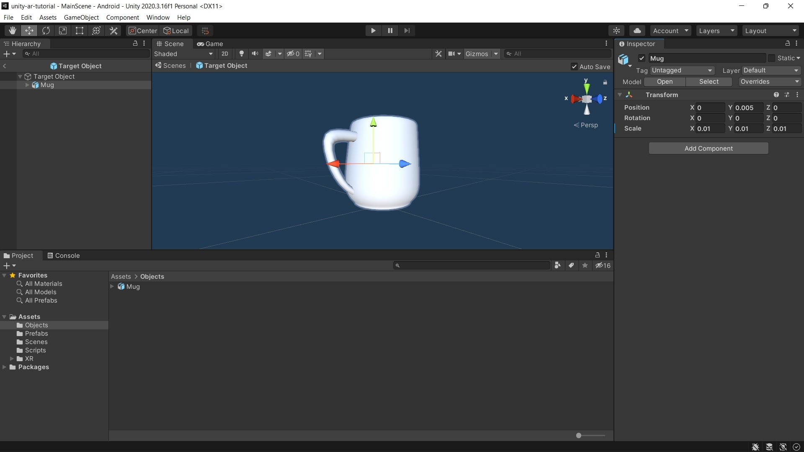

# Unity AR Tutorial
 

This repository contains an example of AR Foundation and a tutorial on creating an AR application for Android devices using Unity.

# Tutorial
In this tutorial, you will learn how to set up AR Foundation in Unity and use it to create your first AR project on Android platform.

[Click here to start tutorial.](https://sadra1f.github.io/unity-ar-tutorial/)

# License
See license in [LICENSE.md](https://github.com/sadra1f/unity-ar-tutorial/blob/main/LICENSE.md)