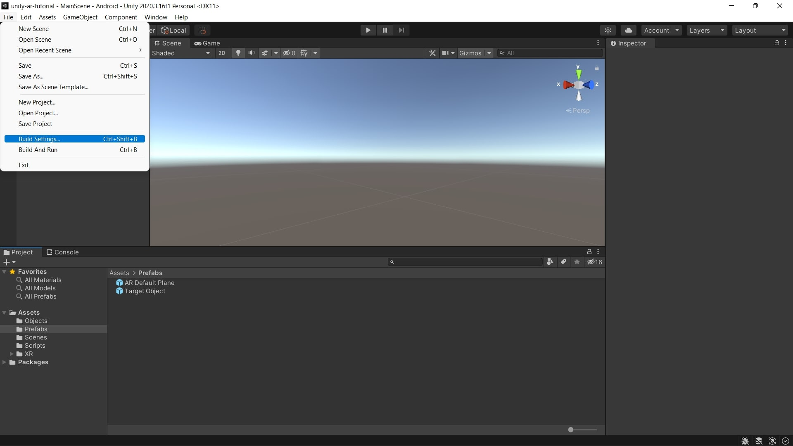
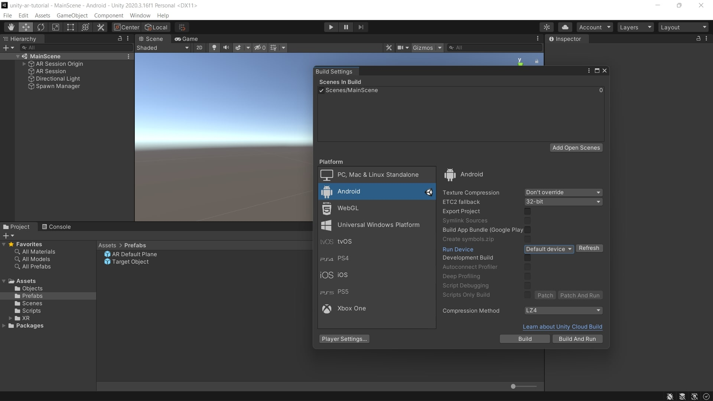
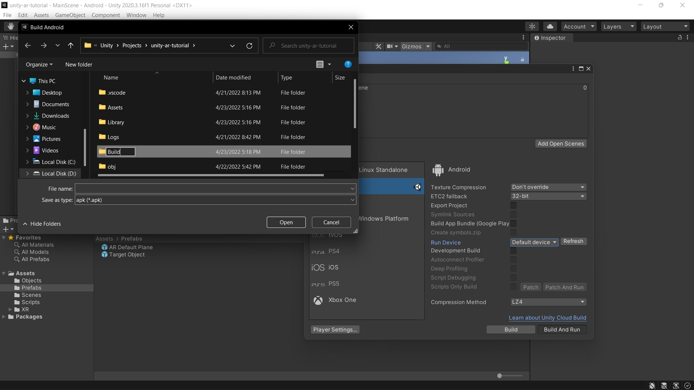
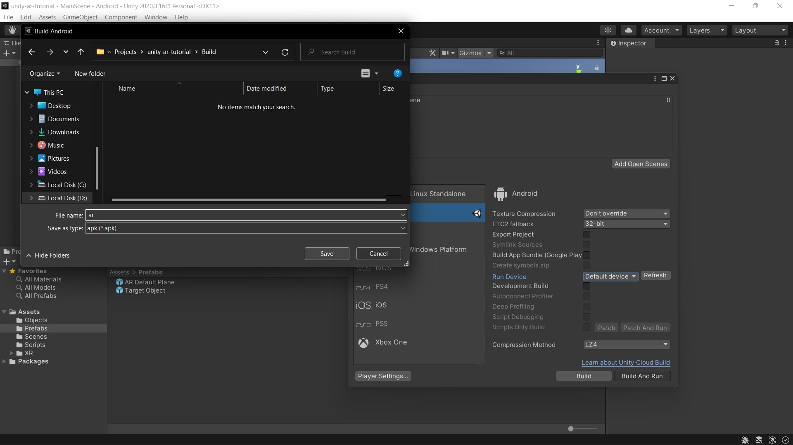

# Building and running the app
In this part, you will learn how to build an apk file and run it on your Android device.

## 1. Connect your Android Device
1. Connect your Android device to your computer’s USB port.
    - If your computer is not recognizing your phone, make sure you have the necessary device drivers. You can also swipe down your phone screen and see if there is an option that says **Charging this device via USB**. If you see this option, tap on it and select the **File Transfer** option.
2. Enable **USB Debugging**.
    - Go to your phone’s **Settings > About Phone** tap on **Build Number** 7 times. Go back to the **Setting’s main page > Developer Options** and enable **USB debugging**.

## 2. Build and run the project
1. In the Unity Editor click on **File > Build Settings**.

2. Click on the **Refresh** button.
3. Select your device or select the **Default device** option.

4. You can check the **Development Build** if you are not going to publish the apk file.
5. Click on the **Build And Run** button.
6. Create a **New folder** and name it **Build**.

7. Open the folder.
8. Enter the **File name**.
9. Click on the **Save** button.

10. The app will run on your device after some moments.

&nbsp;

[< Manipulating objects](manipulating-objects.md) - [Home >](../README.md)