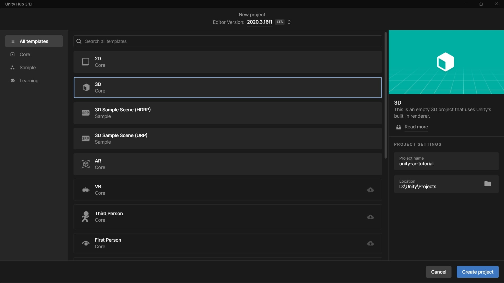

# Creating AR project
In this part, you will learn to create a new Unity Project.

## 1. Create new project
1. Open Unity Hub.
2. Click on the **New project** button.
3. Select **3D Core** template.
4. Enter project name.
5. Select project location.
6. Click the **Create project** button.

&nbsp;

[< Installing Unity](installing-unity.md) - [Setting up ARCore... >](setting-up.md)