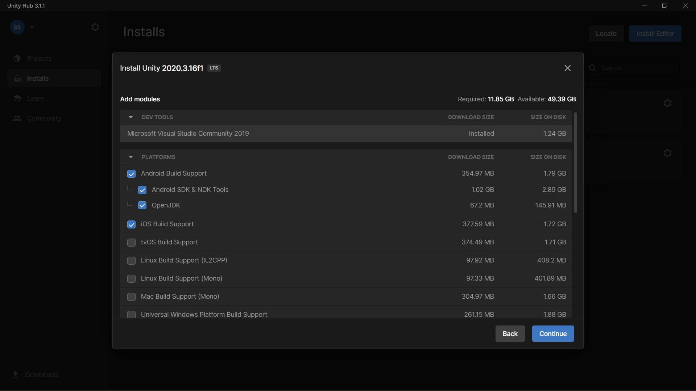
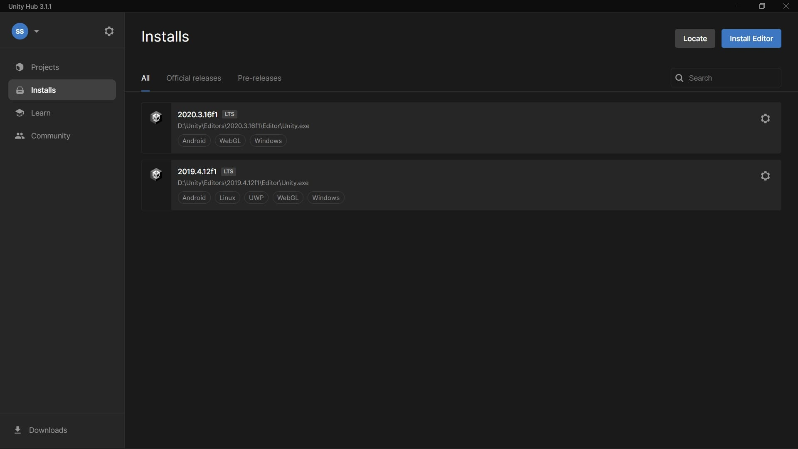

# Installing Unity
Before you begin this project, check that your computer meets the requirements for Unity.

There are some [minimum system requirements](https://docs.unity3d.com/2020.3/Documentation/Manual/system-requirements.html) for Unity.

## 1. Download Unity Hub
1.  Go to the [Unity download page](https://unity.com/download).
2. Under **1. Download the Unity Hub**, select the option for your operating system.
3. Launch the Unity Hub installer.
4. Follow your platform instructions to install the Unity Hub.

## 2. Install Unity Editor
1. Open the Unity Hub application.
2. Choose an install location then select Install to install the Unity Editor.
    - If you cant find your required version, you can use [Unity download archive](https://unity3d.com/get-unity/download/archive) to find and intall it.
3. Choose the required modules.
4. Unity Hub will download and install the editor.

## 3. Modify Editors
You can find and modify your installed editors or install new ones in **Installs** page.

&nbsp;

[< Overview](overview.md) - [Creating project >](creating-project.md)
