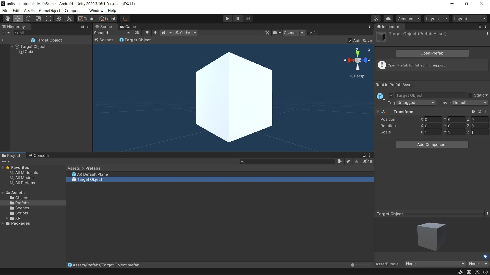
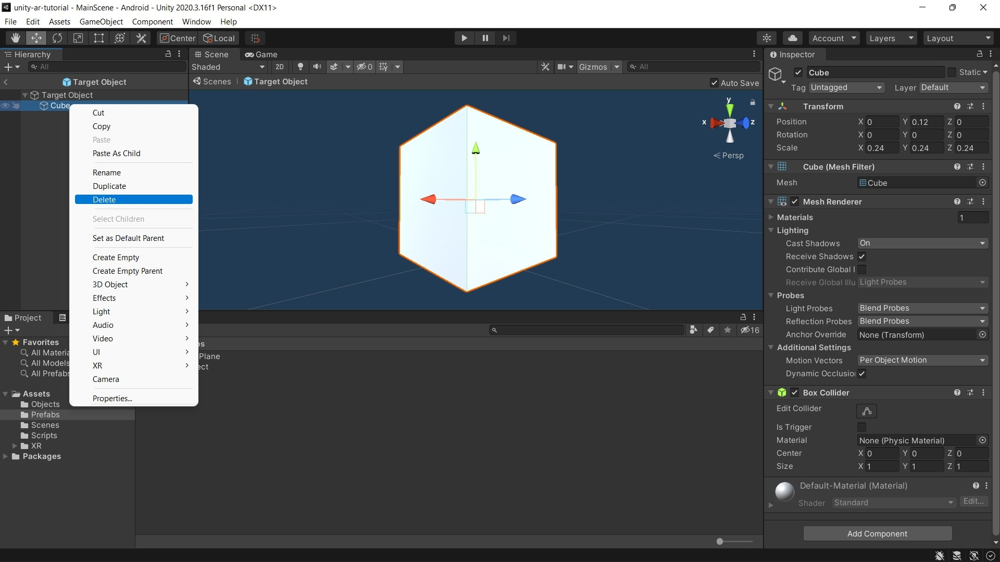
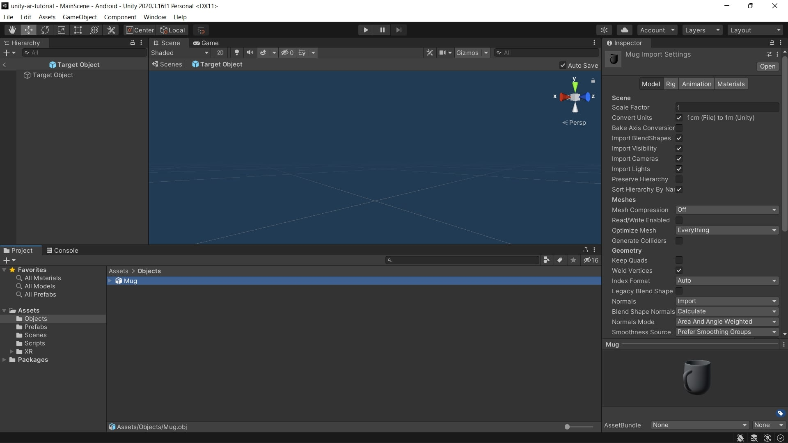

# Manipulating objects
In this part, you will learn how to manipulating objects and prefabs.

## 1. Add 3D Model
1. Create a **Folder** named **Objects** in the **Assets** folder by right-clicking on the **Assets > Create > Folder**.
2. Drag and drop your **obj** file into the folder.

## 2. Manipulate Target Prefab
1. Double click on the **Target Object** in the **Prefabs** folder.

2. Delete the **Cube** object inside **Target Object**.

3. Drag and drop your object from the **Objects** folder into the **Target Object** in **Hierarchy**.

4. Modify **scale** and **position**.
    - If you're using the mug object from this project, you should set the **scale** of the object to 0.01 in all dimensions and **position** to be 0.005 in the **Y** dimension.

&nbsp;

[< Placing objects...](placing-objects.md) - [Building the app >](building-running.md)