# Placing objects in AR
This part will help you understand how to use plane detection in AR foundation to place an object on a plane and you will create an AR app that has the functionality to place an object on a detected plane with a tap.

## 1. Enable Plane Detection
1. Double click on the **AR Session Origin** object in the **Hierarchy**.
2. Add the **AR Plane Manager** component.

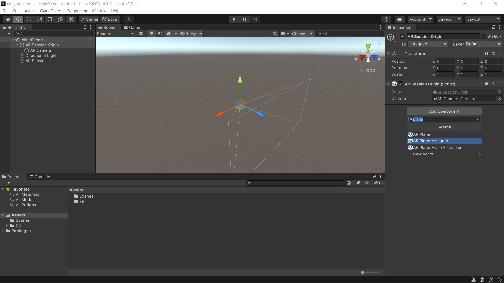

3. Select **Horizontal** in the drop-down menu for **Detection Mode**.
    - You might have to click **Nothing** first, before setting it to **Horizontal**.

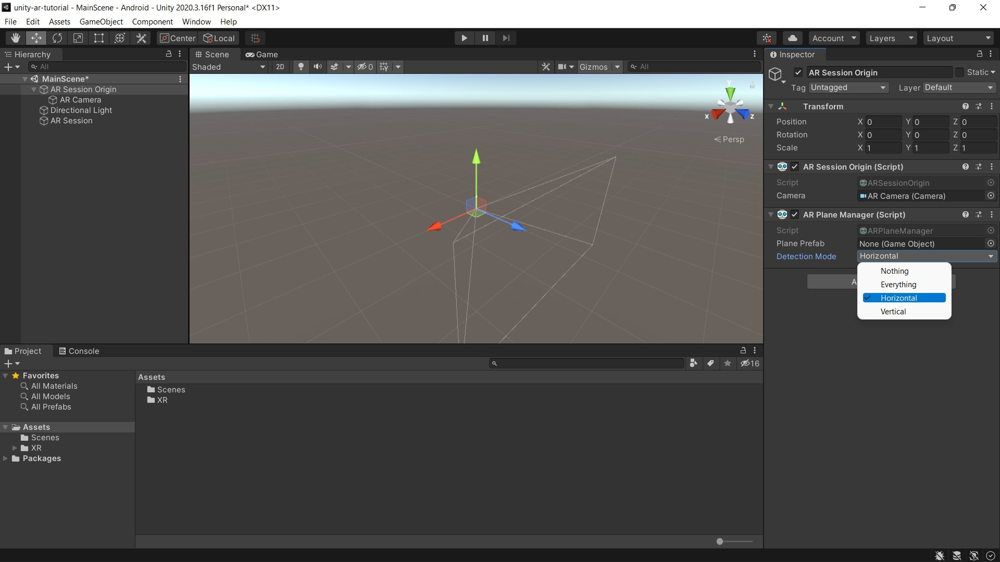

4. The manager is now tracking horizontal planes.

## 2. Visualize Planes
1. Create an **AR Default Plane** object by right-clicking on the **Hierarchy > XR > AR Default Plane**.

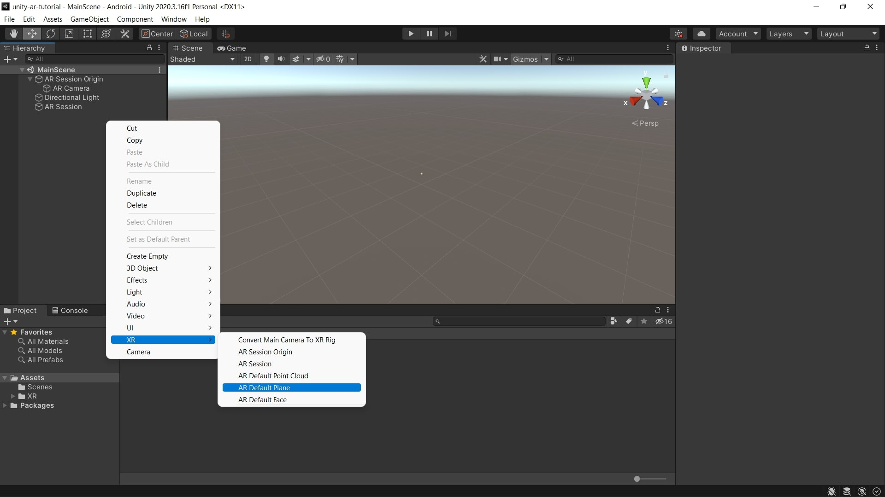

2. Create a **Folder** named **Prefabs** in the **Assets** folder by right-clicking on the **Assets > Create > Folder**.

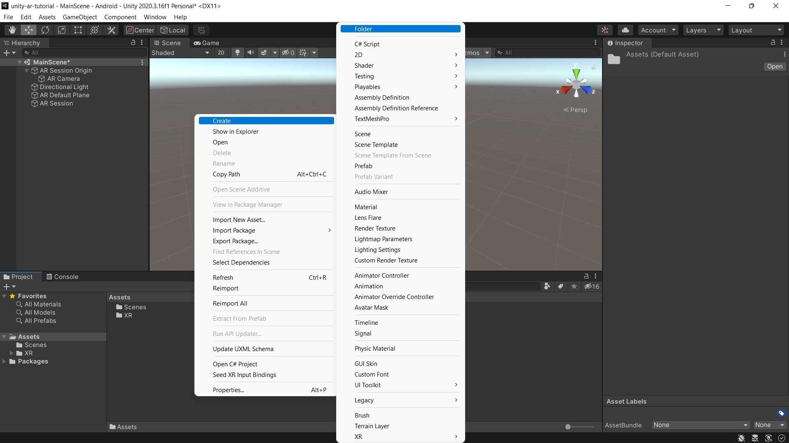

3. Drag and drop the **AR Default Plane** object into the **Prefabs** folder to save it as a prefab.

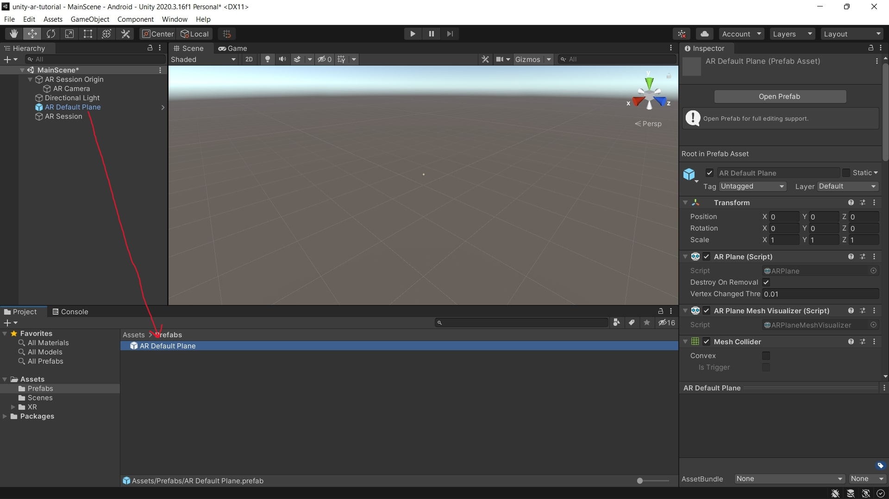

4. Delete the **AR Default Plane** object from the **Hierarchy**.
5. Double click on the **AR Session Origin** object in the **Hierarchy**.
6. Drag and drop the **AR Default Plane** prefab from the folder into the **AR Plane Manager** **Plane Prefab** field.

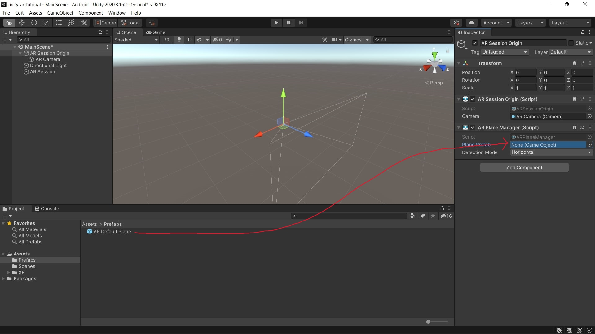

## 3. Place cube on plane
1. Double click on the **AR Session Origin** object in the **Hierarchy**.
2. Add the **AR Raycast Manager** component.
3. Create a **Cube** by right-clicking on the **Hierarchy > 3D Object > Cube**.

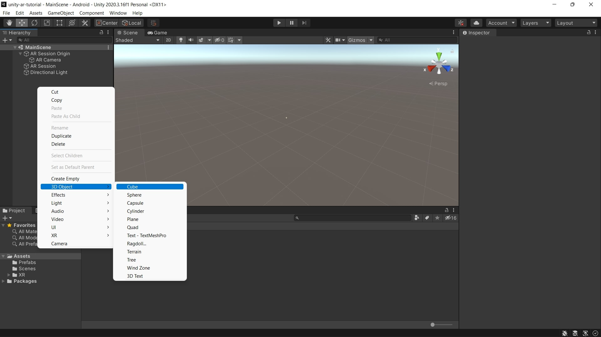

4. Create an **Empty Object** by right-clicking on the **Hierarchy > Create Empty** and rename it to **Spawn Manager**.
5. Create another **Empty Object** named **Target Object**.
6. Drag and drop the **Cube** on the **Target Object** in **Hierarchy**.
7. Double click on the **Cube** object in the **Hierarchy**.
8. Set the **scale** of the cube to 0.24 in all dimensions in the **Inspector**.
9. Set the **position** of the cube to be 0.12 in the **Y** dimension.

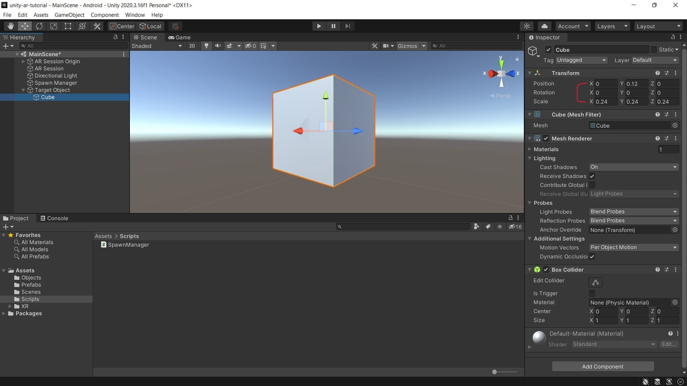

10. Drag and drop the **Target Object** into the **Prefabs** folder to save it as a prefab.

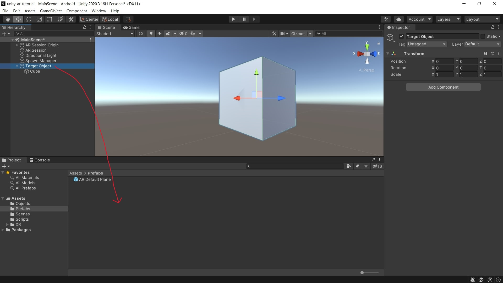

11. Delete the **Target Object** object from the **Hierarchy**.

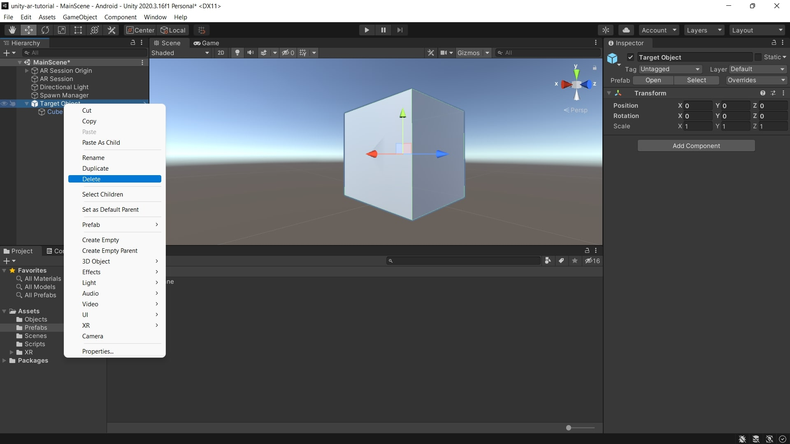

12. Create a **Folder** named **Scripts** in the **Assets** folder by right-clicking on the **Assets > Create > Folder**.
13. Create a **C# Script** named **SpawnManager** in the **Assets** folder by right-clicking on the **Assets > Create > Folder**.

14. Open **SpawnManager** script and replace it's content with the script below:

```cs
using System.Collections;
using System.Collections.Generic;
using UnityEngine;
using UnityEngine.EventSystems;
using UnityEngine.XR.ARFoundation;

public class SpawnManager : MonoBehaviour
{
    [SerializeField] Camera cam;
    [SerializeField] ARRaycastManager raycastManager;
    [SerializeField] GameObject obj;

    List<ARRaycastHit> hits;
    GameObject spawnedObj;

    private void Awake()
    {
        hits = new List<ARRaycastHit>();
        spawnedObj = null;
    }

    private void Start()
    {
        if (!cam)
            cam = FindObjectOfType<Camera>();
        if (!raycastManager)
            raycastManager = FindObjectOfType<ARRaycastManager>();
    }

    private void Update()
    {
        if (Input.touchCount == 0) return;

        RaycastHit hit;

        Touch touch = Input.GetTouch(0);
        Ray ray = cam.ScreenPointToRay(touch.position);


        if (
            !EventSystem.current.IsPointerOverGameObject(touch.fingerId)
            && raycastManager.Raycast(touch.position, hits)
        )
        {
            if (
                touch.phase == TouchPhase.Began
                && !spawnedObj
                && Physics.Raycast(ray, out hit)
            )
            {
                SpawnObject(hits[0].pose.position);
            }
            else if (
                (
                    touch.phase == TouchPhase.Moved
                    || touch.phase == TouchPhase.Began
                )
                && spawnedObj
            )
            {
                spawnedObj.transform.position = hits[0].pose.position;
            }
        }
    }

    private void SpawnObject(Vector3 position)
    {
        if (spawnedObj) Destroy(spawnedObj);
        spawnedObj = Instantiate(obj, position, Quaternion.identity);
    }
}
```

15. Double click on the **Spawn Manager** object in the **Hierarchy**.
16. Add the **SpawnManager** script as a component.
17. Drag and drop the **Target Object** from the **Prefabs** folder into the **Spawn Manager** **Obj** field.

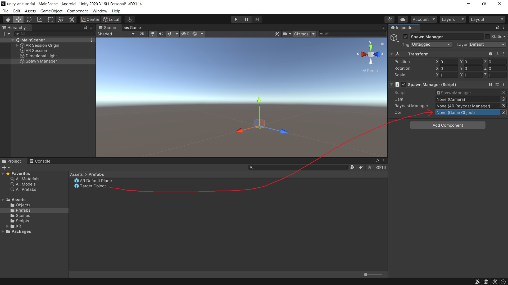

18. You can now [build and run](building-running.md) your project. Make sure to tap your screen to instantiate a cube!

&nbsp;

[< Setting up ARCore...](setting-up.md) - [Manipulating objects >](manipulating-objects.md)