# Setting up Unity for ARCore development
In this part, you will learn how to set up your Unity Project for AR development and add core AR components in your Scene.

## 1. Change Build Settings
Configure build settings to build your project for android devices.

1. Open your newly created project.
2. Click on **File > Build Settings**.
3. Click on **Add Open Scenes** button.
4. Click on the **Android** platform option.
5. Click on the **Switch Platform** button.

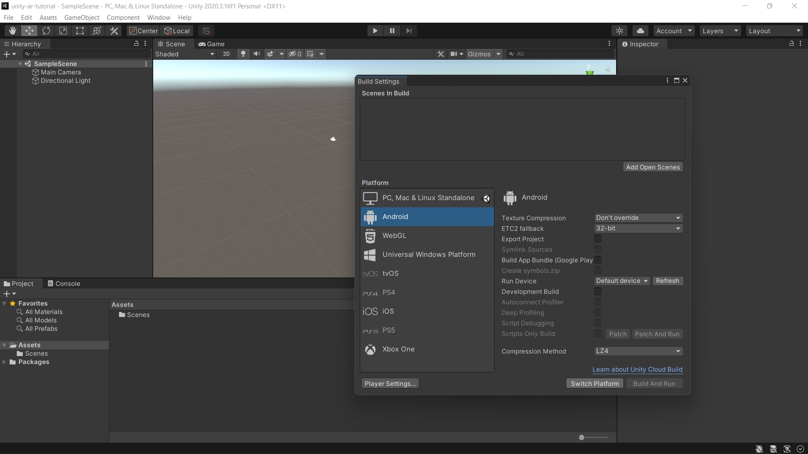

## 2. Install XR Plugin Management
1. Click on **Edit > Project Settings**.
2. Select the **XR Plugin Management** tab.
3. Click on the **Install XR Plugin Management** button.

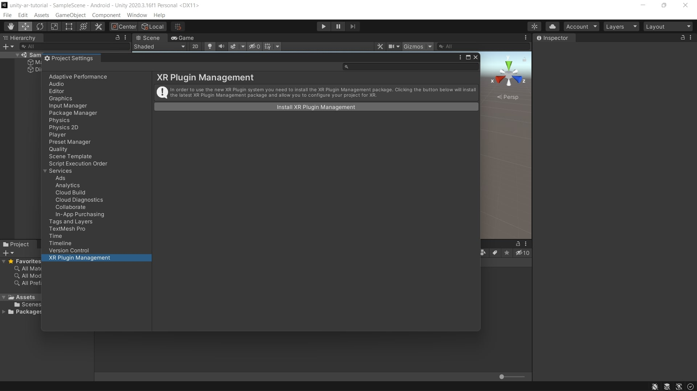

4. Click the tab for Android and check the box for **ARCore**.

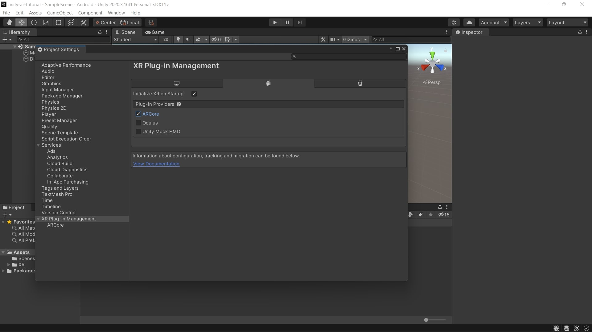

## 3. Install ARFoundation package
1. Click on **Window > Package Manager**.
2. Click on **Packages** drop down menu and select **Unity Registry**.

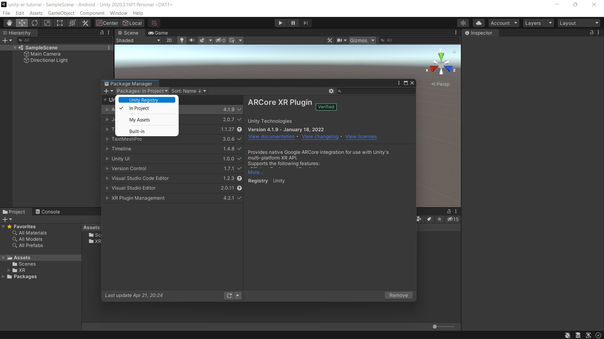

3. Find and select the **AR Foundation** package.
4. Click on the **Install** button.

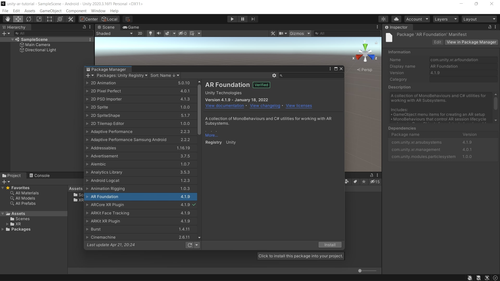

## 4. Configure project settings
1. Click on **Edit > Project Settings**.
2. Select the **Player** tab.
3. You can change the **Company Name** and the **Product Name** here.
4. Make sure you are in the Android settings. You can click on the Android icon to select it.
5. Click on the **Other Settings** section.
6. Make sure the **Auto Graphics API** checkbox is checked.

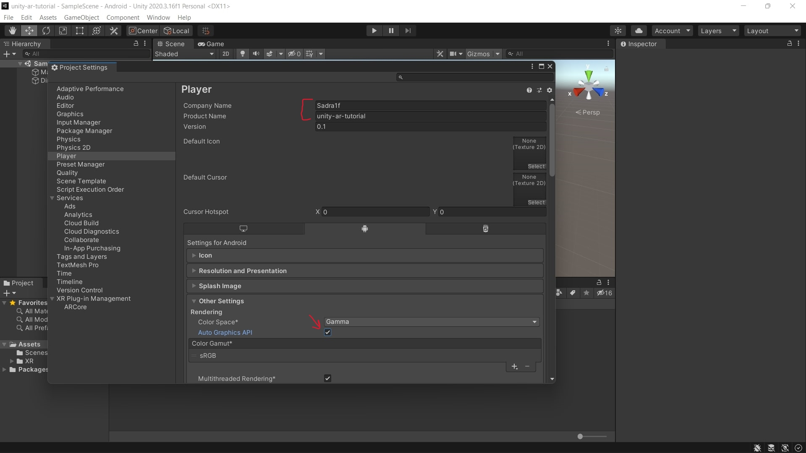

7. Uncheck the **Multithreaded Rendering** checkbox.
8. Set the **Minimum API Level** to **Android 7.0 ‘Nougat’ (API Level 24)**.

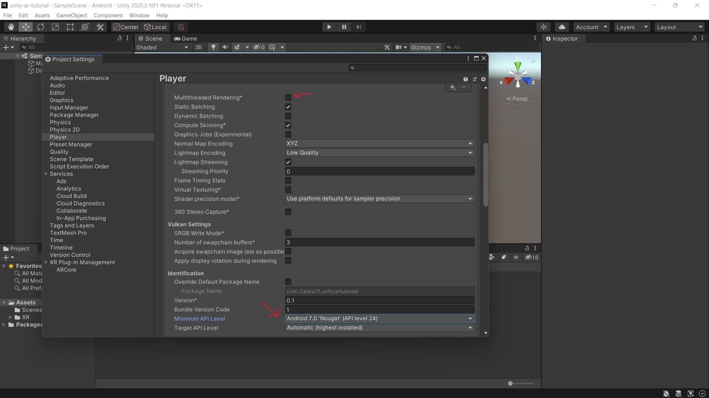

9. Select the **XR** tab.
    - If there is a **Create** button there, click on it and save the settings file.
10. Select **ARCore** under the **XR** tab.
11. Change the **Requirement** option from **Required** to **Optional**.

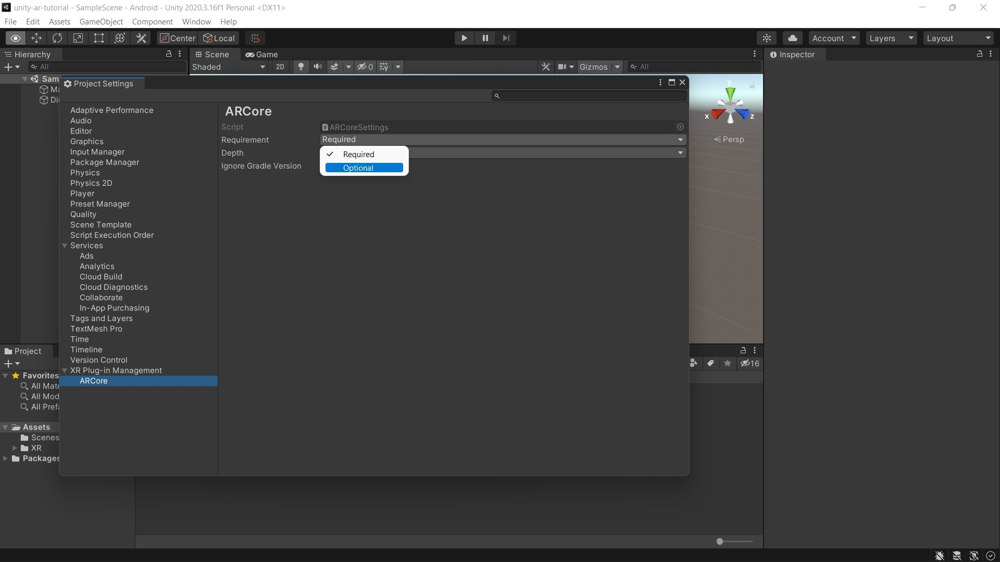

## 5. Create AR Objects

1. In the **Hierarchy**, delete the **Main Camera** by right-clicking on the **Main Camera > Delete**.

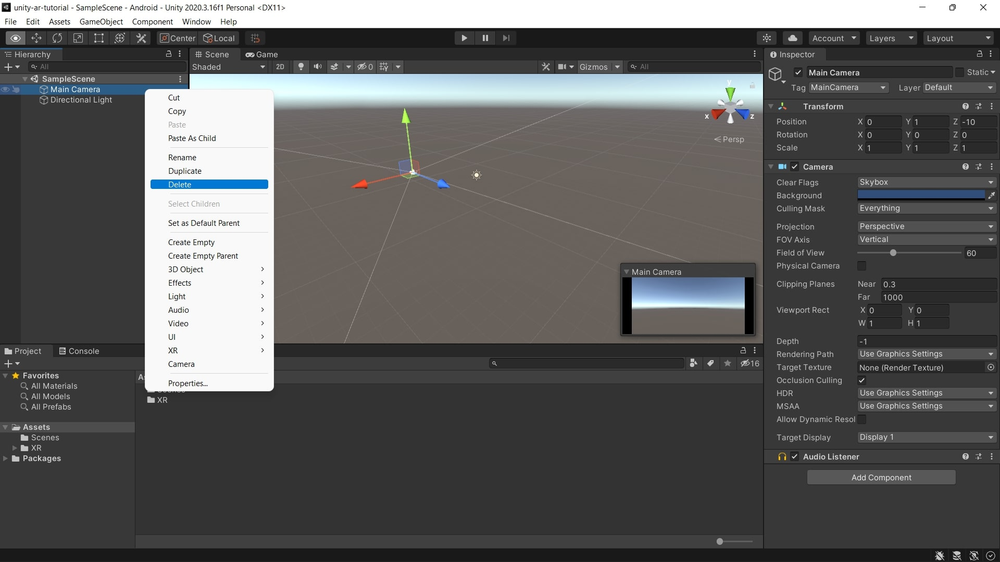

2. Create an **AR Session Origin** object by right-clicking on the **Hierarchy > XR > AR Session Origin**.
3. Create an **AR Session** object by right-clicking on the **Hierarchy > XR > AR Session**.

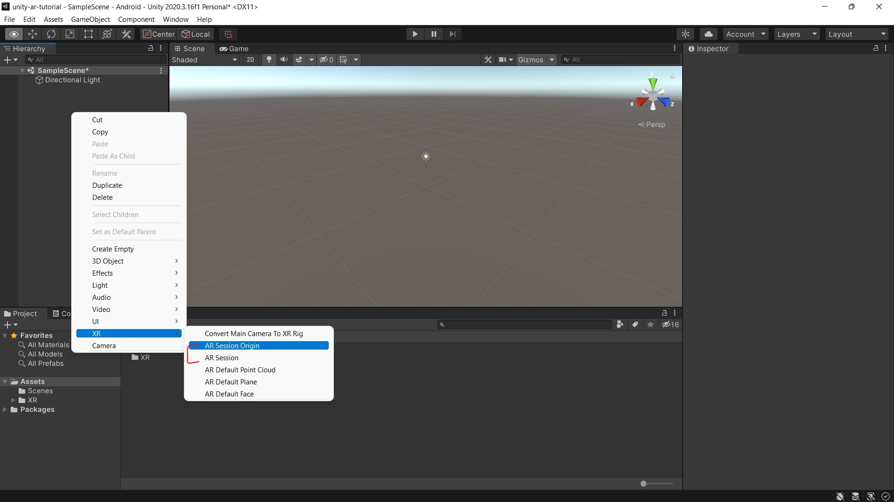

4. In the **Hierarchy**, click on the drop-down arrow next to the **AR Session Origin** object.
5. Click on **AR Camera**.
6. Under the **Inspector**, there is a **Tag** section. Click on the drop down menu and select **MainCamera**.

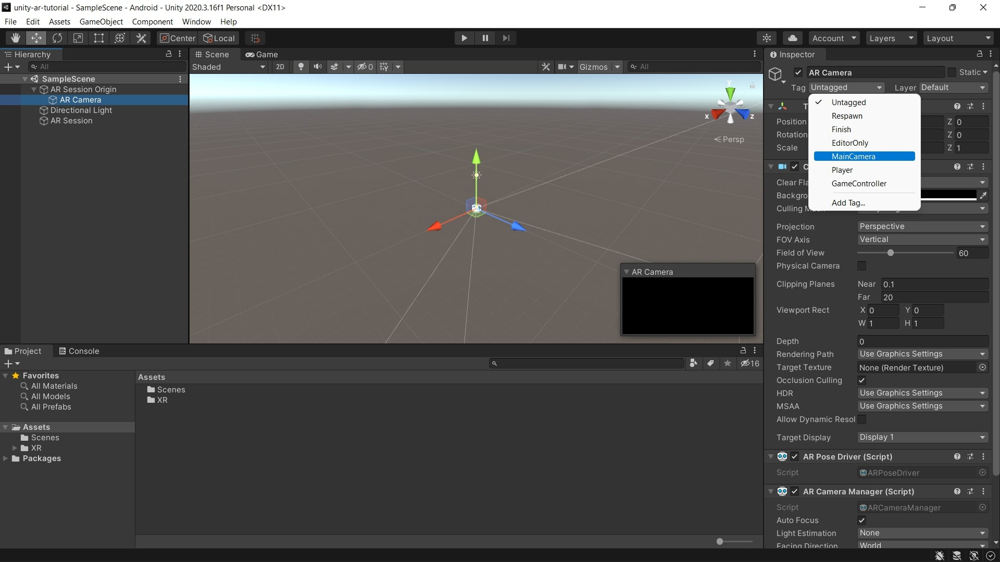

&nbsp;

[< Creating project](creating-project.md) - [Placing objects... >](placing-objects.md)